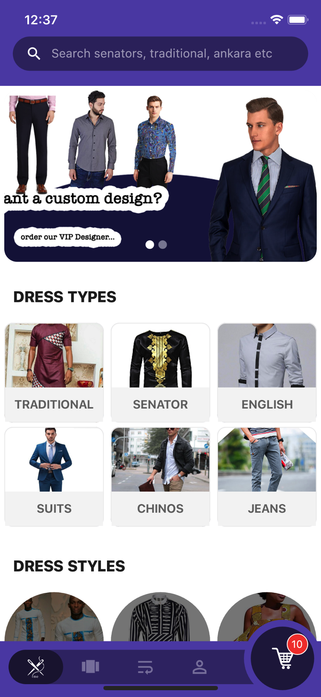
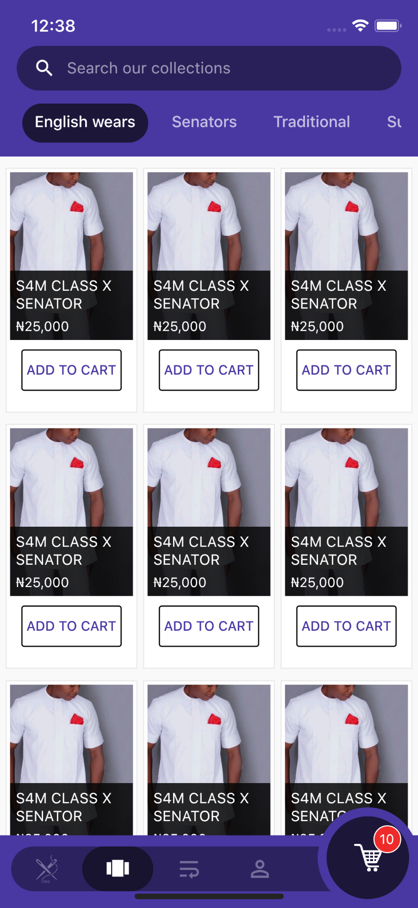
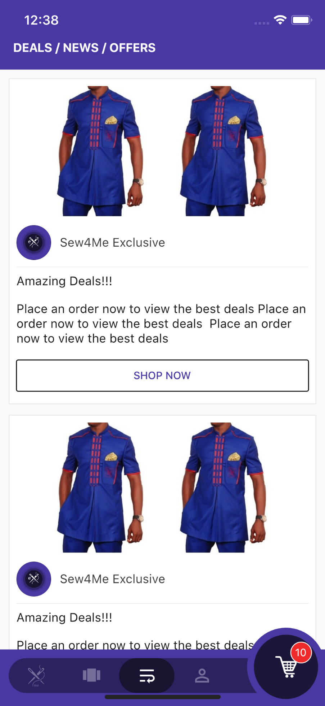
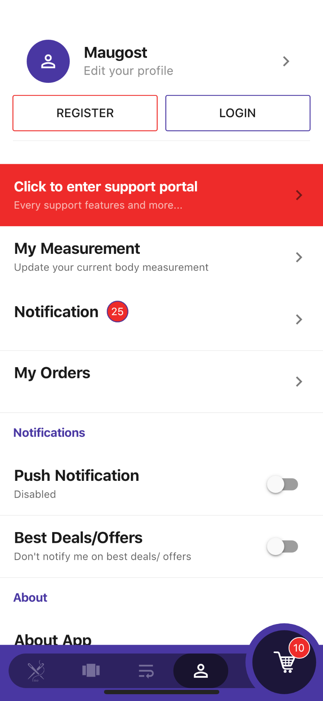
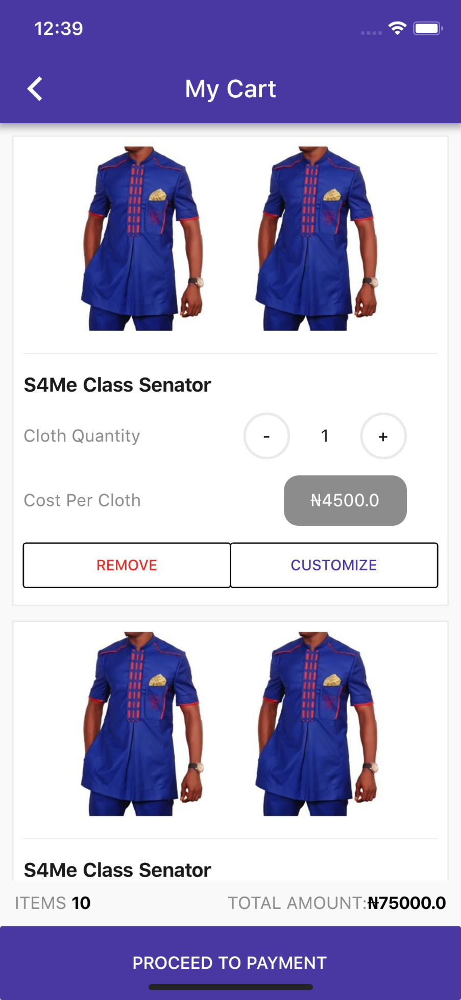
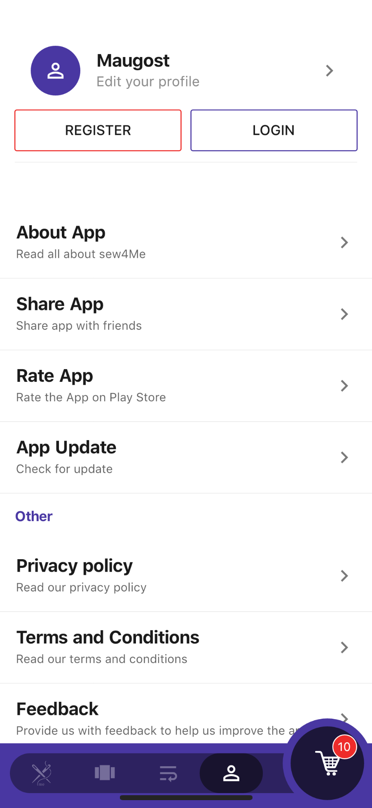
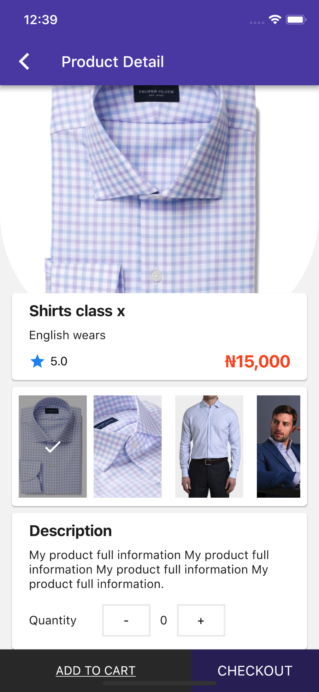
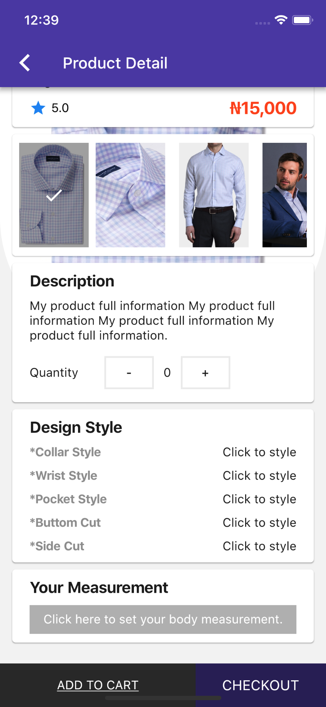
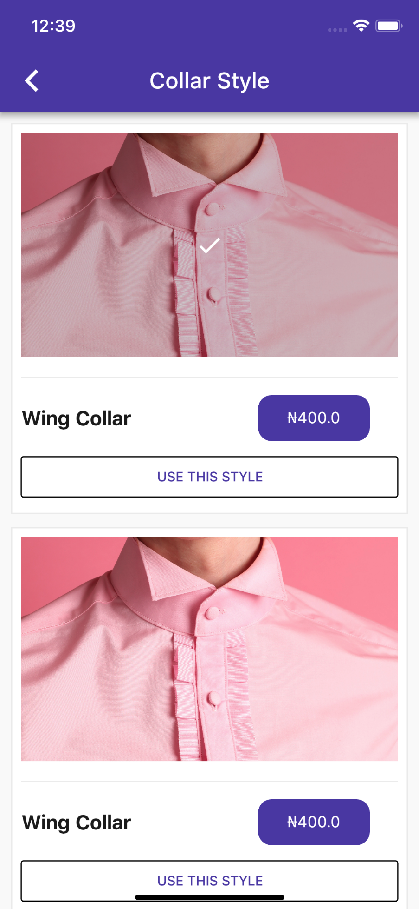
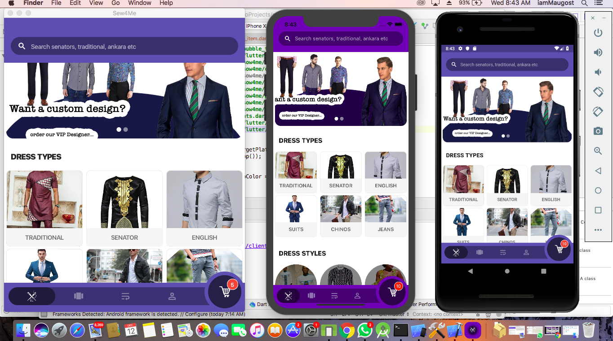

# Sew4me - a Cross-platform Flutter project still in development.... that enables users to sew and customize their cloths via mobile without the need to visit a tailor.

## Basic App Screens

  
  
  

## Multi-Platform Screen

Mac desktop App, IOS App, Android App

## To Get Started
For help getting started with Flutter, view our online
[documentation](https://flutter.io/).
